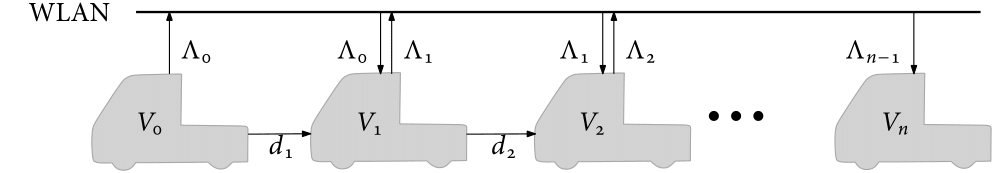

# Distributed Platform for Slotcar Platooning 
Slotcar Platooning is a platform for demonstration of vehicular longitudinal control with strings of vehicles. 
The slotcars combine the BeagleBone Blue boards, encoders, and proximity sensors inside a slotcar chassis. 
The chassis is part custom printed, part universal slotcar racing starter kit. 
This repository combines two parts:
* Scripts for generating code for multiple distributed systems and control of code execution.
* Design files, drivers and Simulink libraries for the slotcars.

The first part serves a general purpose and could be used with any distributed project based on the BeagleBone Blue. 
The other builds a low-cost experimental platform of controllable slotcars.
* **_cad_/** folder contains the slotcar design files, that is the custom bodywork chassis and a list of used parts
* **_examples_/** folder contains templates and shared experiments to demonstrate the use of the project
* **_models_/** folder contains Simulink libraries of slotcar control building blocks
* **_src_/** folder contains important scripts for the purpose of code generation for distributed systems and other code such as _C/C++_ s-functions
* **_util_/** folder contains helper scripts for generating mex files and setting up the Simulink project